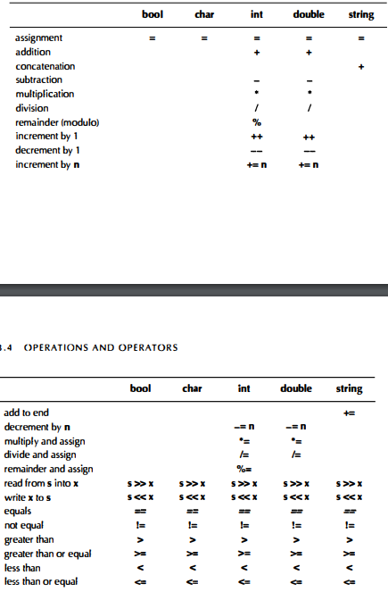

# Chapter 3: Objects, Types, and Values

- Object - region of memory with a type that specifies what kind of information can be placed in it

- Variable - a named object

- '<<' and '>>' are operators

- You cannot put values of the wront type into a variable

- Initialization = giving a variable its initial value

- Assignment = giving a variable a new value

- Both Initialization and Assignment are similar enough that C++ allows the use of the same notation "="

- variable names must start with a letter. They can only contain letters, digits, or underscore.

- C++ reserves about 70 names as "keywords" (Ex: "if", "while"). They cannot be used as names to your variables, types, functions etc.

### Some Review of types of objects

- A __type__ defines a set of possible values and a set of operations (for an object).
- An __object__ is osme memory that holds a value of a given type.
- A __value__ is a set of bits in memory interpreted according to a type.
- A __variable__ is a named object.
- A __declaration__ is a statement that gives a name to an object.
- A __definition__ is a declaration that sets aside memory for an object.

### Other Stuff

- __Strings__ are slightly more complicated than that of an __int__ because a __string__ keeps track fo the number of characters it holds.

- Every __int__, __bool__, __char__, and __double__ is of the same size; the compiler sets aside the same fixed amount of memory for each __int__.

- Always initialize your variables.

- can use __char-to-int__ conversions for safe numeric representations of a character. No info lost.

### Safe Conversions

- __bool__ to __char__
- __bool__ to __int__
- __bool__ to __double__
- __char__ to __int__
- __char__ to __double__
- __int__ to __double__

- __int__ to __double__ is very useful as it allows us to mix __ints__ and __doubles__ in expressions.